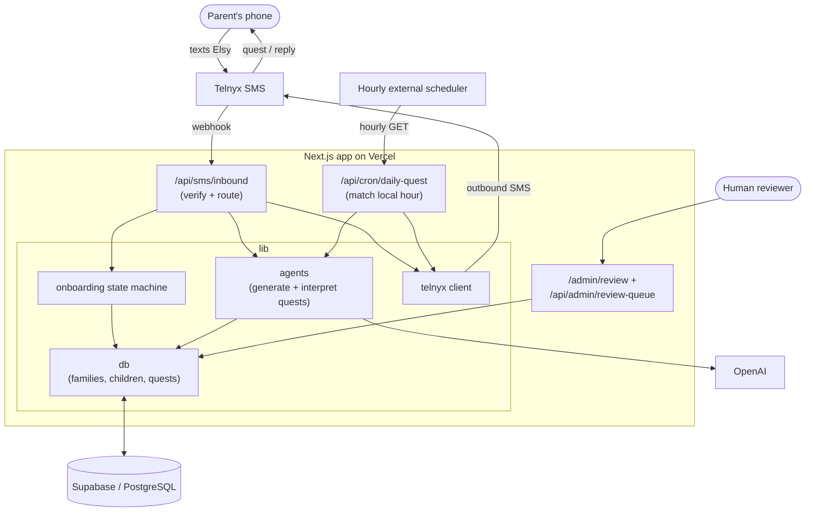

# Else

[](https://github.com/yiyaw-lab/thinkelse/actions/workflows/ci.yml)
[](LICENSE)

Else is a text-based family curiosity coach. Parents text **Elsy** — a warm, intellectually playful AI companion — and Elsy sends personalized daily curiosity quests designed to help children think beyond the obvious.

## Mission

Help parents raise thoughtful children in the AI age, one tiny curiosity quest at a time.

## The Else loop

1. A parent texts the Else number to get started
2. Elsy onboards the family — learning the child's name, age, and interests
3. Elsy sends a personalized curiosity quest every day at a preferred time
4. The parent shares their child's response via SMS
5. Elsy interprets the response, offers a warm follow-up, and grows with the child

## How it works

Everything runs on Next.js (App Router) on Vercel. Routes stay thin: each route
hands off to the AI reasoning layer in `lib/agents`, the database helpers in
`lib/db`, and the Telnyx helpers in `lib/telnyx`. Supabase (PostgreSQL) is the
single source of truth; OpenAI generates and interprets quests; Telnyx carries
SMS in both directions.

There are two entry points. **Inbound SMS** (`/api/sms/inbound`) is a Telnyx
webhook that verifies the signature, then either runs SMS compliance keywords
(STOP / HELP / START), advances the onboarding state machine, or interprets a
child's response and replies. **The daily-quest cron** (`/api/cron/daily-quest`)
is polled hourly (an external scheduler on Vercel Hobby), matches each family's
local hour against their preferred time, generates a quest, and sends it. Quests
from the first 50 families are flagged `pending` for human QA via the admin
review queue (`/admin/review` + `/api/admin/review-queue`).



## Stack

| Layer | Tech |
|---|---|
| Framework | Next.js (App Router, TypeScript) |
| Database | Supabase (PostgreSQL) |
| SMS | Telnyx |
| AI | OpenAI (GPT-4.1 mini) |
| Hosting | Vercel |

## Architecture

Routes stay thin. Intelligence lives in `lib/agents`. Database operations live in `lib/db`. External service logic is isolated in service-specific helpers.

```
app/
  api/
    sms/inbound/      — Telnyx webhook, orchestrates all SMS logic
    cron/daily-quest/ — Vercel cron for scheduled quest delivery
    health/           — Health check
lib/
  agents/             — AI reasoning (quest generation, response interpretation)
  db/                 — Database helpers (families, children, quests)
  telnyx/             — Telnyx client, outbound SMS
  onboarding.ts       — Onboarding state machine
docs/
  ARCHITECTURE.md     — Architecture decisions
```

## Data model

```
families  ──→  children  ──→  quests
```

- **families** — phone, parent name, preferred quest time, timezone, SMS opt-in status, onboarding step
- **children** — name, age, interests (linked to a family)
- **quests** — prompt, mission, follow-up, skill, child response (linked to a child)

## Local development

### Prerequisites

- Node.js 18+
- A [Supabase](https://supabase.com) project with the schema applied
- A [Telnyx](https://telnyx.com) account with an SMS-capable number on a messaging profile
- An [OpenAI](https://platform.openai.com) API key

### Environment variables

Create a `.env.local` file:

```bash
SUPABASE_URL=https://your-project.supabase.co
SUPABASE_SERVICE_ROLE_KEY=your-service-role-key

OPENAI_API_KEY=sk-...

TELNYX_API_KEY=KEYxxxxxxxx
TELNYX_PHONE_NUMBER=+1xxxxxxxxxx
TELNYX_MESSAGING_PROFILE_ID=your-messaging-profile-uuid
TELNYX_PUBLIC_KEY=your-base64-public-key
```

`TELNYX_PHONE_NUMBER` must be E.164 format (e.g. `+14155551234`).

`TELNYX_MESSAGING_PROFILE_ID` is the UUID from **Messaging → Messaging Profiles** in the Telnyx portal (same profile your number is assigned to).

### Supabase GitHub integration

Schema lives in `supabase/migrations/`. To connect Supabase to this repo:

1. **Working directory:** `.` (repo root)
2. **Migration path:** `supabase/migrations`
3. **Branch:** `main`

If your Supabase project **already has these tables**, mark the initial migration as applied before enabling auto-deploy:

```bash
npx supabase login
npx supabase link --project-ref YOUR_PROJECT_REF
npx supabase migration repair --status applied 20250613120000
```

### Telnyx setup

1. In the [Telnyx Portal](https://portal.telnyx.com), go to **Messaging** → **Messaging Profiles** and create a profile (or use an existing one).
2. Assign your purchased number to that messaging profile.
3. Set the profile **Webhook URL** to your app's inbound endpoint:
   - Production: `https://elsey.app/api/sms/inbound`
   - Local dev: use [ngrok](https://ngrok.com) and point at `https://your-ngrok-subdomain.ngrok.io/api/sms/inbound`
4. Copy your API key from **API Keys** in the portal.
5. Copy your **Public Key** from **Keys & Credentials → Public Key** (required in production for webhook signature verification).
6. Copy the **Messaging Profile ID** (UUID) into `TELNYX_MESSAGING_PROFILE_ID`.
7. After **10DLC brand + campaign** are approved, assign your number to the campaign:
   - Portal: **Messaging → 10DLC → Campaigns** → your campaign → **Assign Numbers**
   - Inbound can work before this step; **outbound US A2P will fail** until the number is linked.

### Daily quest cron (Hobby / free Vercel)

Vercel Hobby only allows **one cron per day**, but Else checks preferred times hourly. Use an external scheduler (e.g. [cron-job.org](https://cron-job.org)) to `GET` your cron endpoint every hour:

```
https://elsey.app/api/cron/daily-quest
Authorization: Bearer YOUR_CRON_SECRET
```

### Quest review queue (first 50 families)

Quests from the first 50 families are flagged `review_status: pending` for human QA.

**Web UI:** [https://elsey.app/admin/review](https://elsey.app/admin/review) (enter `ADMIN_SECRET`)

```bash
# List pending quests
curl -H "Authorization: Bearer YOUR_ADMIN_SECRET" https://elsey.app/api/admin/review-queue

# Approve / flag / skip
curl -X PATCH https://elsey.app/api/admin/review-queue \
  -H "Authorization: Bearer YOUR_ADMIN_SECRET" \
  -H "Content-Type: application/json" \
  -d '{"questId":"...","status":"approved","notes":"optional"}'
```

Uses `ADMIN_SECRET` if set, otherwise falls back to `CRON_SECRET`.

### SMS compliance keywords

Inbound SMS handles standard keywords before quest logic:

- **STOP** (also STOPALL, UNSUBSCRIBE, CANCEL, END, QUIT) — opts out and confirms
- **HELP** (also INFO) — sends program help text
- **START** (also UNSTOP, YES) — re-subscribes opted-out families
- **HELLO** — re-subscribes if opted out; otherwise treated as onboarding for new numbers

### Timezone-aware daily quests

Onboarding now asks for US timezone after preferred send time. The hourly cron matches each family's **local hour** (not UTC) and skips families who already received a quest that local day.

Apply migration `20250613160000_sms_opt_in_and_timezone.sql` in Supabase if not auto-deployed.

## API routes

| Route | Method | Description |
|---|---|---|
| `/api/sms/inbound` | POST | Telnyx webhook — handles all inbound SMS |
| `/api/cron/daily-quest` | GET | Sends daily quests to families at their preferred time |
| `/api/health` | GET | Health check |
| `/api/test-quest` | GET | Generate a sample quest (local dev only) |
| `/api/test-interpret` | GET | Generate a sample Elsy reply (local dev only) |
| `/api/admin/review-queue` | GET, PATCH | Human review queue for first 50 families |
| `/admin/review` | GET | Web UI for quest review queue |
