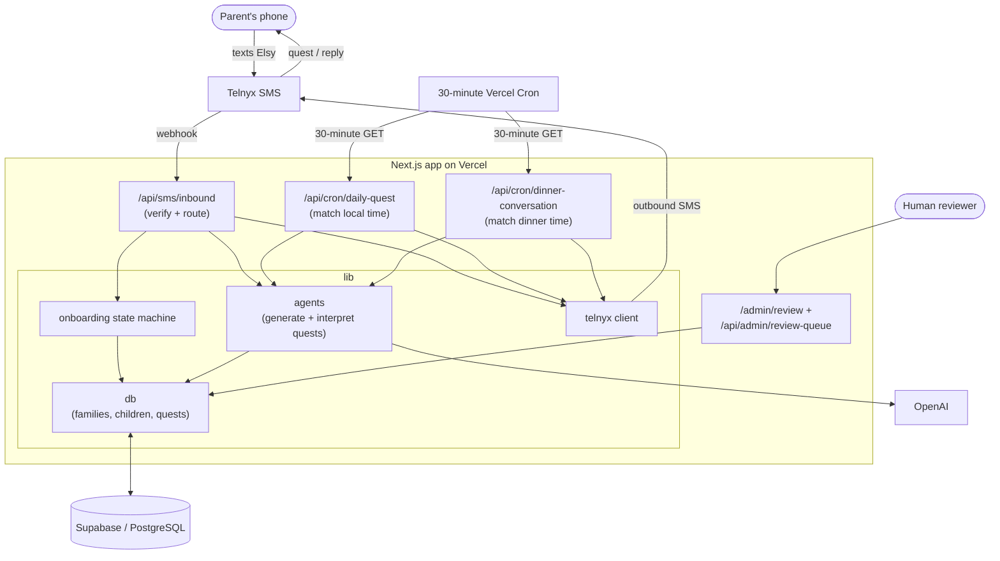

# Else

[](https://github.com/yiyaw-lab/thinkelse/actions/workflows/ci.yml)
[](LICENSE)

Else is a text-based family curiosity coach. Parents text **Elsy** — a warm, intellectually playful AI companion — and Elsy sends personalized daily curiosity quests designed to help children think beyond the obvious.

## Mission

Help parents raise thoughtful children in the AI age, one tiny curiosity quest at a time.

The product doctrine lives in `docs/THINKELSE_CONSTITUTION.md`: what it means to
think else, why this matters in an automated world, and the capacities Elsy is
trying to help families practice. The send-quality bar lives in
`docs/ELSY_QUALITY_RUBRIC.md`.

## The Else loop

1. A parent texts the Else number to get started
2. Elsy onboards the family — learning each child's name, age, and interests
3. Elsy sends personalized curiosity quests at the family's preferred time
4. The parent shares each child's response via SMS
5. Elsy interprets the response, offers a warm follow-up, and grows with each child

## How it works

Everything runs on Next.js (App Router) on Vercel. Routes stay thin: each route
hands off to the AI reasoning layer in `lib/agents`, the database helpers in
`lib/db`, and the Telnyx helpers in `lib/telnyx`. Supabase (PostgreSQL) is the
single source of truth; OpenAI generates and interprets quests; Telnyx carries
SMS in both directions. Quest generation also draws from a typed
evidence-informed technique catalog in `lib/agents/research-techniques.ts`,
documented in `docs/EVIDENCE_INFORMED_TECHNIQUES.md`.

There are two entry points. **Inbound SMS** (`/api/sms/inbound`) is a Telnyx
webhook that verifies the signature, then either runs SMS compliance keywords
(STOP / HELP / START), advances the onboarding state machine, adds child
profiles, or interprets a child-specific response and replies. **The daily-quest
cron** (`/api/cron/daily-quest`) is invoked every 30 minutes by Vercel Cron,
matches each family's local hour and minute against their preferred time,
generates one age- and interest-tuned quest per child, and sends it. Quests from
the first 50 families are flagged `pending` for human QA via the admin review
queue (`/admin/review` + `/api/admin/review-queue`).
**The dinner-conversation cron** (`/api/cron/dinner-conversation`) uses the same
30-minute cadence for opted-in families, but sends one family-level dinner
question instead of creating a quest row.



## Stack

| Layer | Tech |
|---|---|
| Framework | Next.js (App Router, TypeScript) |
| Database | Supabase (PostgreSQL) |
| SMS | Telnyx |
| AI | OpenAI (GPT-4.1 mini) |
| Hosting | Vercel |

## Architecture

Routes stay thin. Intelligence lives in `lib/agents`. Database operations live in `lib/db`. External service logic is isolated in service-specific helpers.

```
app/
  api/
    sms/inbound/      — Telnyx webhook, orchestrates all SMS logic
    cron/daily-quest/ — scheduler route for quest delivery
    cron/dinner-conversation/ — scheduler route for dinner questions
    admin/dinner-nudges/ — guarded one-time setup nudge for existing families
    health/           — Health check
lib/
  agents/             — AI reasoning (quest generation, response interpretation)
  db/                 — Database helpers (families, children, quests)
  telnyx/             — Telnyx client, outbound SMS
  onboarding.ts       — Onboarding state machine
docs/
  ARCHITECTURE.md     — Architecture decisions
  THINKELSE_CONSTITUTION.md — Product principles and long-horizon learning philosophy
  ELSY_QUALITY_RUBRIC.md — Canonical review standard for quests, dinner, and replies
  ELSY_EVALUATION_HARNESS.md — Deterministic fixtures for quest and dinner quality
  EVIDENCE_INFORMED_TECHNIQUES.md — Research-backed quest methodology catalog
```

## Data model

```
families  ──→  children  ──→  quests
    ├────→  sms_guardrail_events
    ├────→  family_learning_events
    └────→  dinner_conversations
```

- **families** — phone, parent name, preferred quest time, timezone, SMS opt-in status, dinner conversation preference/time/nudge state, onboarding step
- **children** — one profile per child, with name, age, and interests (linked to a family)
- **quests** — prompt, mission, follow-up, skill, mission completion status, child response (linked to a child)
- **dinner_conversations** — sent dinner-table questions, parent moves, follow-ups, skills, and local send date
- **sms_guardrail_events** — per-phone/family SMS guardrail counters and blocked-event reasons, without storing message content
- **family_learning_events** — durable personalization notes extracted from family replies, suggestions, preferences, avoidances, and successful quest patterns

## Local development

### Prerequisites

- Node.js 18+
- A [Supabase](https://supabase.com) project with the schema applied
- A [Telnyx](https://telnyx.com) account with an SMS-capable number on a messaging profile
- An [OpenAI](https://platform.openai.com) API key

### Environment variables

Create a `.env.local` file:

```bash
SUPABASE_URL=https://your-project.supabase.co
SUPABASE_SERVICE_ROLE_KEY=your-service-role-key

OPENAI_API_KEY=sk-...

TELNYX_API_KEY=KEYxxxxxxxx
TELNYX_PHONE_NUMBER=+1xxxxxxxxxx
TELNYX_MESSAGING_PROFILE_ID=your-messaging-profile-uuid
TELNYX_PUBLIC_KEY=your-base64-public-key

# Optional. Use 1/true/light for light world-context dinner prompts,
# deeper/medium for medium-sensitivity cards, or omit/0/false to disable.
DINNER_WORLD_CONTEXT_ENABLED=0
```

`TELNYX_PHONE_NUMBER` must be E.164 format (e.g. `+14155551234`).

`TELNYX_MESSAGING_PROFILE_ID` is the UUID from **Messaging → Messaging Profiles** in the Telnyx portal (same profile your number is assigned to).

### Supabase GitHub integration

Schema lives in `supabase/migrations/`. To connect Supabase to this repo:

1. **Working directory:** `.` (repo root)
2. **Migration path:** `supabase/migrations`
3. **Branch:** `main`

If your Supabase project **already has these tables**, mark the initial migration as applied before enabling auto-deploy:

```bash
npx supabase login
npx supabase link --project-ref YOUR_PROJECT_REF
npx supabase migration repair --status applied 20250613120000
```

### Telnyx setup

1. In the [Telnyx Portal](https://portal.telnyx.com), go to **Messaging** → **Messaging Profiles** and create a profile (or use an existing one).
2. Assign your purchased number to that messaging profile.
3. Set the profile **Webhook URL** to your app's inbound endpoint:
   - Production: `https://elsey.app/api/sms/inbound`
   - Local dev: use [ngrok](https://ngrok.com) and point at `https://your-ngrok-subdomain.ngrok.io/api/sms/inbound`
4. Copy your API key from **API Keys** in the portal.
5. Copy your **Public Key** from **Keys & Credentials → Public Key** (required in production for webhook signature verification).
6. Copy the **Messaging Profile ID** (UUID) into `TELNYX_MESSAGING_PROFILE_ID`.
7. After **10DLC brand + campaign** are approved, assign your number to the campaign:
   - Portal: **Messaging → 10DLC → Campaigns** → your campaign → **Assign Numbers**
   - Inbound can work before this step; **outbound US A2P will fail** until the number is linked.

### Daily quest scheduler (production)

Production is deployed to the Coaur Vercel Pro team, so scheduled delivery uses native Vercel Cron in `vercel.json`:

```txt
Path: /api/cron/daily-quest
Schedule: 0,30 * * * * (every 30 minutes, UTC)
```

`CRON_SECRET` must be set in Vercel for Production. Do not store the secret in this repository. The cron runs every 30 minutes because onboarding accepts whole-hour and half-hour daily quest times, and `/api/cron/daily-quest` only sends when the family's preferred local hour and minute match. The route sends each child profile at most one quest per local day.

To verify who would receive a daily quest without sending SMS, call the cron in
dry-run mode. This still requires `CRON_SECRET` in production and does not call
OpenAI, send Telnyx SMS, create quest rows, or record guardrail events:

```bash
curl -H "Authorization: Bearer YOUR_CRON_SECRET" "https://elsey.app/api/cron/daily-quest?dryRun=1"
```

### Dinner conversation scheduler (production)

Optional dinner questions use native Vercel Cron too:

```txt
Path: /api/cron/dinner-conversation
Schedule: 0,30 * * * * (every 30 minutes, UTC)
```

Families opt in by replying YES during onboarding, then choosing a dinner
question time such as `6pm` or `6:30pm`. Existing completed families can reply
**DINNER** to set it up, **DINNER 6:30PM** or **DINNER ON 6:30PM** to set it
immediately, or **DINNER OFF** to pause it. Dinner prompts are family-level SMS
messages and do not create quest rows or mission completions.

To verify who would receive a dinner question without sending SMS, call:

```bash
curl -H "Authorization: Bearer YOUR_CRON_SECRET" "https://elsey.app/api/cron/dinner-conversation?dryRun=1"
```

Dinner prompt generation can optionally use curated world-context cards for
current-event-adjacent prompts about fairness, evidence, trust, technology,
community, disagreement, and tradeoffs. This is disabled by default. Set
`DINNER_WORLD_CONTEXT_ENABLED=light` only after previewing outputs locally with
`/api/test-dinner?world=1`; set `deeper` only for reviewed medium-sensitivity
cards. The generator must not mention live headlines, parties, politicians,
violent events, or ask children to know the news.

For current opted-in SMS families who never saw the dinner setup question, use
the guarded admin route:

```bash
# Dry run candidates
curl -H "Authorization: Bearer YOUR_ADMIN_SECRET" https://elsey.app/api/admin/dinner-nudges

# Send the one-time nudge
curl -X POST https://elsey.app/api/admin/dinner-nudges \
  -H "Authorization: Bearer YOUR_ADMIN_SECRET" \
  -H "Content-Type: application/json" \
  -d '{"send":true,"limit":100}'
```

### Quest review queue (first 50 families)

Quests from the first 50 families are flagged `review_status: pending` for human QA.
Mission completion is tracked separately with `mission_status` and `completed_at`; review actions should not be used for family progress counts.

**Web UI:** [https://elsey.app/admin/review](https://elsey.app/admin/review) (enter `ADMIN_SECRET`)

```bash
# List pending quests
curl -H "Authorization: Bearer YOUR_ADMIN_SECRET" https://elsey.app/api/admin/review-queue

# Approve / flag / skip
curl -X PATCH https://elsey.app/api/admin/review-queue \
  -H "Authorization: Bearer YOUR_ADMIN_SECRET" \
  -H "Content-Type: application/json" \
  -d '{"questId":"...","status":"approved","notes":"optional"}'
```

Uses `ADMIN_SECRET` if set, otherwise falls back to `CRON_SECRET`.

### Production deploy freshness

`/api/health` reports the short Vercel Git commit SHA and environment. The
`Production Deploy Smoke` GitHub Action runs after pushes to `main` and polls
`https://elsey.app/api/health` until production reports the same commit SHA.
This catches stale or disconnected Vercel Git deployments after merges.

### SMS compliance keywords

Inbound SMS handles standard keywords before quest logic:

- **STOP** (also STOPALL, UNSUBSCRIBE, CANCEL, END, QUIT) — opts out and confirms
- **HELP** (also INFO) — sends program help text
- **START** (also UNSTOP, YES) — re-subscribes opted-out families
- **HELLO** — re-subscribes if opted out; otherwise treated as onboarding for new numbers
- **QUEST** / **NEW MISSION** (also QUEST NOW, NEW QUEST, ANOTHER QUEST, NEXT MISSION, SEND QUEST, START MISSION, TODAY'S QUEST) — sends an on-demand quest after onboarding is complete
- **QUEST FOR [child name]** / **NEW MISSION FOR [child name]** — sends an on-demand quest for a specific child profile
- **WHY** (also WHY THIS, PARENT CONTEXT, RESOURCE) — sends parent-only context and one optional resource link for the latest mission or dinner question
- **ADD CHILD** (also ADD ANOTHER CHILD, NEW CHILD, ADD KID, ADD SIBLING) — adds another child profile with its own age and interests
- **DINNER** / **DINNER [time]** / **DINNER ON [time]** — starts optional dinner-question setup or sets it immediately, e.g. DINNER 6:30PM
- **DINNER OFF** — pauses optional dinner questions while keeping daily quests active
- **SETTINGS** (also SETUP, CHANGE TIME, UPDATE TIMEZONE, RESET ONBOARDING) — restarts the daily-time/timezone setup for completed families

### SMS abuse guardrails

The inbound webhook keeps compliance keywords (`STOP`, `HELP`, `START`, `HELLO`) ahead of normal throttles, then applies practical limits before any OpenAI work:

- Telnyx webhook payloads over 64 KB are rejected before JSON parsing.
- SMS message bodies over 1,000 characters are not processed into onboarding, quests, or interpretation.
- Non-keyword inbound messages are limited per phone.
- On-demand `QUEST` requests are limited and also skip if that child already has a quest for the local day.
- Interpretation replies and outbound sends are throttled per phone.
- Onboarding inputs are bounded: short parent/child names, child ages 5-12, up to 6 short interests, and explicit `am`/`pm` preferred times.

Guardrail counters are stored in `sms_guardrail_events` with event type, status, reason, body length, phone, and optional family id. Message content is not stored in the guardrail table.

### Timezone-aware daily quests

Onboarding asks for US timezone after preferred send time, then asks whether the family wants optional dinner questions for richer family conversation. If the parent replies YES, Elsy asks for a dinner question time and persists `families.dinner_conversation_opt_in`, `families.dinner_conversation_time`, and setup timestamps. Daily quest delivery is unchanged.

Completing onboarding does not send a quest automatically; families can reply **QUEST**, **NEW MISSION**, or **QUEST FOR [child name]** for one immediately, or wait for the 30-minute scheduler. The scheduler matches each family's **local hour and minute** (not UTC) and skips child profiles who already received a quest that local day.

Apply migration `20250613160000_sms_opt_in_and_timezone.sql` in Supabase if not auto-deployed.
Apply migration `20260627045600_dinner_conversation_opt_in.sql` to add the dinner preference column.
Apply migration `20260626220504_sms_abuse_guardrails.sql` to add SMS guardrail event logging and indexes.
Apply migration `20260702212301_child_personalization_indexes.sql` to add multi-child routing indexes.
Apply migration `20260702214957_dinner_conversation_flow.sql` to add dinner scheduling and one-time nudge tracking.

### Mission completion persistence

New quests start as `mission_status: assigned`. After onboarding is complete, a non-keyword parent SMS reply to an active quest is classified before Elsy acts on it. If only one child has an active quest, Elsy can route the reply directly. If multiple children have active quests, the parent should prefix the reply with the child name, such as `Mira: she noticed the shadow moved`. Child-response replies save the response and mark that child's quest `mission_status: completed` with `completed_at`. Feedback-only replies, such as requests for shorter quests or more building activities, are acknowledged and stored as `family_learning_events` without completing the active quest. This gives future dashboards a stable count of completed missions without conflating family progress with `review_status`.

Future quest generation reads recent child-specific `family_learning_events` alongside that child's quest history, so Elsy can tune quests toward what worked, honor parent preferences, and avoid patterns the family disliked.

Apply migration `20250613170000_quest_completion_status.sql` in Supabase if not auto-deployed.
Apply migration `20260702211407_family_learning_events.sql` to add durable family learning.

## API routes

| Route | Method | Description |
|---|---|---|
| `/api/sms/inbound` | POST | Telnyx webhook — handles all inbound SMS |
| `/api/cron/daily-quest` | GET | Sends daily quests to families at their preferred time; `?dryRun=1` reports without sending |
| `/api/cron/dinner-conversation` | GET | Sends optional dinner-table questions to opted-in families; `?dryRun=1` reports without sending |
| `/api/health` | GET | Health check |
| `/api/test-quest` | GET | Generate a sample quest (local dev only) |
| `/api/test-interpret` | GET | Generate a sample Elsy reply (local dev only) |
| `/api/test-dinner` | GET | Generate a sample dinner conversation SMS (local dev only) |
| `/api/admin/review-queue` | GET, PATCH | Human review queue for first 50 families |
| `/api/admin/dinner-nudges` | GET, POST | Dry-run or send one-time dinner setup nudges |
| `/admin/review` | GET | Web UI for quest review queue |
